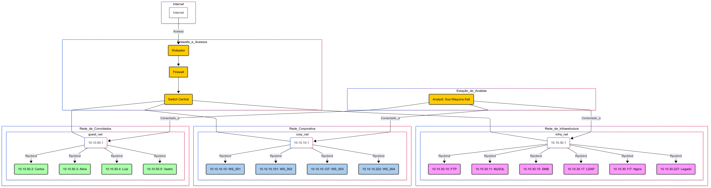

# Relatório de Mapeamento de Rede - Projeto Final Opção 1

**Autor:** Amanda Augusta da Silva Romão 
**Data:** 24 de julho de 2025
**Versão:** 1.0

---

## 1. Sumário Executivo

Este relatório detalha os resultados de um mapeamento de rede e análise de exposição de segurança realizado em um ambiente Docker simulado, representando uma rede corporativa. Foram identificadas três sub-redes distintas: corporativa, de infraestrutura e de convidados. A análise revelou exposições significativas em serviços-chave, com destaque para uma **vulnerabilidade crítica de credencial padrão (`root`) no servidor MySQL** e **múltiplas políticas de segurança fracas no servidor Samba**, incluindo permissão de acesso anônimo, senhas mínimas curtas, ausência de complexidade e falta de bloqueio de conta. Tais falhas comprometem gravemente a Confidencialidade e Integridade dos dados e sistemas da rede. As recomendações prioritárias incluem a imediata alteração de senhas padrão e o endurecimento das configurações do Samba para mitigar esses riscos de alto impacto.

---

## 2. Objetivo

Este documento tem como objetivo apresentar os resultados de um mapeamento de rede e análise de exposição de segurança realizado em um ambiente simulado Docker. O foco principal foi identificar ativos, serviços em execução, suas versões, e configurações vulneráveis que podem comprometer os pilares de Confidencialidade, Integridade e Disponibilidade (CIA) da rede. O relatório visa fornecer um diagnóstico inicial da postura de segurança da rede e propor recomendações de mitigação para melhorar sua resiliência contra ataques cibernéticos.

---

## 3. Escopo e Contexto

A análise foi conduzida em um laboratório Docker simulado, representando uma rede de escritório com diferentes segmentos de rede.

* **Ambiente de Análise:** Container `analyst`, atuando como máquina de ataque (Kali Linux-like), conectado a todas as sub-redes.
* **Sub-redes Analisadas:**
    * Rede Corporativa (`corp_net`): `10.10.10.0/24`
    * Rede de Infraestrutura (`infra_net`): `10.10.30.0/24`
    * Rede de Convidados (`guest_net`): `10.10.50.0/24`
* **Hosts Analisados:** Todos os hosts ativos identificados dentro das sub-redes mencionadas, incluindo servidores e estações de trabalho simuladas.
* **Limites da Análise:** Esta análise focou em reconhecimento ativo, incluindo varredura de hosts, portas e serviços, detecção de sistemas operacionais e enumeração de SMB/SNMP. Não incluiu testes de exploração ativa que pudessem comprometer a estabilidade dos sistemas, nem análise aprofundada de vulnerabilidades de aplicações web (exceto as configurações baseadas na exposição dos serviços).

---

## 4. Metodologia

O processo de mapeamento de rede e identificação de exposições foi conduzido seguindo as fases de reconhecimento ativo, utilizando um conjunto de ferramentas de cibersegurança padrão da indústria, executadas a partir do container `analyst`.

* **Ferramentas Utilizadas:**
    * **Docker Compose:** Utilizado para orquestrar e gerenciar o ambiente de laboratório simulado.
    * **Nmap (versão 7.95):** Ferramenta fundamental para descoberta de hosts (`-sn`), varredura de portas (`-sV`), detecção de serviços/versões e detecção de sistema operacional (`-O`).
    * **`ftp` (cliente CLI):** Cliente de linha de comando para testar conectividade e acesso anônimo a serviços FTP.
    * **`enum4linux-ng` (versão 1.3.4):** Ferramenta especializada para enumeração de informações SMB/NetBIOS, buscando detalhes como sessões nulas, usuários, grupos, compartilhamentos e políticas de segurança.
    * **`snmpwalk`:** Ferramenta para enumerar informações de dispositivos via protocolo SNMP, utilizando community strings padrão.

* **Etapas do Reconhecimento:**
    1.  **Configuração do Ambiente:** O laboratório foi iniciado e verificado usando `docker-compose up -d --build` na pasta `projeto_final_opcao_1`, garantindo que todos os 14 containers estivessem operacionais.
    2.  **Descoberta de Hosts Ativos:** A partir do container `analyst`, foi realizada uma varredura de ping (`nmap -sn`) em cada uma das sub-redes (`10.10.10.0/24`, `10.10.30.0/24`, `10.10.50.0/24`) para identificar os endereços IP dos dispositivos online.
    3.  **Varredura Detalhada de Portas, Serviços e SO:** Para cada host ativo identificado, foi executada uma varredura detalhada com `nmap -sV -O <IP>` para detectar portas abertas (TCP e UDP), identificar os serviços e suas respectivas versões, e tentar inferir o sistema operacional em execução.
    4.  **Enumeração de Serviços Específicos:**
        * **FTP (10.10.30.10 - `ftp-server`):** Tentativa de login anônimo para verificar permissões de acesso a arquivos.
        * **SMB (10.10.30.15 - `samba-server`):** Execução de `enum4linux-ng` para buscar sessões nulas, usuários, grupos, compartilhamentos e políticas de segurança, explorando as vulnerabilidades clássicas do SMB.
        * **SNMP (10.10.30.117 - `zabbix-server`):** Tentativa de enumeração com `snmpwalk` e a community string padrão "public" para verificar vazamento de informações de gerenciamento de rede.

---

## 5. Diagrama de Rede

Abaixo está o diagrama lógico da rede simulada, representando as três sub-redes identificadas e os principais ativos (containers) em cada uma, além da máquina `analyst` (atacante/analista) e suas conexões.





---

## 6. Diagnóstico (Achados / Findings)

A análise da rede simulada revelou diversas exposições e vulnerabilidades que podem impactar negativamente a postura de segurança dos pilares de Confidencialidade, Integridade e Disponibilidade.

### Achado 6.1: Credenciais Padrão Críticas no Servidor MySQL (10.10.30.11)

* **Achado:** O servidor MySQL, parte da rede de infraestrutura, está configurado com uma credencial padrão e extremamente fraca para o usuário `root`.
* **Evidência:** A análise do arquivo de configuração `docker-compose.yml` do ambiente, que define a senha do banco de dados, revela a seguinte configuração para o serviço `mysql-server`:
    ```yaml
    mysql-server:
      environment:
        MYSQL_ROOT_PASSWORD: root
    ```
* **Impacto:** **CRÍTICO - Confidencialidade e Integridade comprometidas.** A utilização de credenciais padrão (`root` com senha `root`) em um banco de dados de alta importância, como o MySQL, representa um risco altíssimo. Qualquer atacante com acesso à rede e conhecimento básico de MySQL pode facilmente obter controle total sobre o banco de dados. Isso resulta em acesso não autorizado a dados, incluindo leitura de informações sensíveis, modificação, ou exclusão de dados críticos e financeiros, comprometendo gravemente a confidencialidade e a integridade das informações armazenadas.

### Achado 6.2: Políticas de Segurança SMB Fracas no Servidor Samba (10.10.30.15)

* **Achado:** O servidor Samba, localizado na rede de infraestrutura, apresenta múltiplas configurações de segurança enfraquecidas que o tornam altamente vulnerável a diversos ataques.
    * **Permissão de Sessões Nulas (Anonymous Access):** O servidor permite que qualquer usuário se conecte ao serviço SMB sem fornecer qualquer credencial.
    * **Políticas de Senha Fracas:** As políticas de senha configuradas são inadequadas, exigindo um comprimento mínimo de apenas 5 caracteres e não impondo complexidade (uso de caracteres especiais, números, letras maiúsculas/minúsculas).
    * **Ausência de Bloqueio de Conta:** Não há limite configurado para o número de tentativas de login falhas, permitindo ataques de força bruta ilimitados contra as contas de usuário.
    * **SMB Signing Desabilitado:** O requisito de assinatura de pacotes SMB está desabilitado (`SMB signing required: false`), o que torna as sessões SMB vulneráveis a ataques de retransmissão e man-in-the-middle.
* **Evidência:** A execução da ferramenta `enum4linux-ng` no host `10.10.30.15` revelou as seguintes informações e configurações:
    ```
    ====================================
    |    Listener Scan on 10.10.30.15    |
    ====================================
    [*] Checking SMB
    [+] SMB is accessible on 445/tcp
    [*] Checking SMB over NetBIOS
    [+] SMB over NetBIOS is accessible on 139/tcp

    ========================================
    |    SMB Dialect Check on 10.10.30.15    |
    ========================================
    [*] Trying on 445/tcp
    [+] Supported dialects and settings:
    Supported dialects:
      SMB 1.0: false
      SMB 2.02: false
      SMB 2.1: true
      SMB 3.0: true
      SMB 3.1.1: true
    Preferred dialect: SMB 3.0
    SMB1 only: false
    SMB signing required: false

    ========================================
    |    RPC Session Check on 10.10.30.15    |
    ========================================
    [*] Check for null session
    [+] Server allows session using username '', password ''
    [*] Check for random user
    [+] Server allows session using username 'lcvdypiu', password ''

    ========================================
    |    Policies via RPC for 10.10.30.15    |
    ========================================
    [*] Trying port 445/tcp
    [+] Found policy:
    Domain password information:
      Password history length: None
      Minimum password length: 5
      Maximum password age: 49710 days 6 hours 21 minutes
      Password properties:
      - DOMAIN_PASSWORD_COMPLEX: false
      - DOMAIN_PASSWORD_NO_ANON_CHANGE: false
      - DOMAIN_PASSWORD_NO_CLEAR_CHANGE: false
      - DOMAIN_PASSWORD_LOCKOUT_ADMINS: false
      - DOMAIN_PASSWORD_PASSWORD_STORE_CLEARTEXT: false
      - DOMAIN_PASSWORD_REFUSE_PASSWORD_CHANGE: false
    Domain lockout information:
      Lockout observation window: 30 minutes
      Lockout duration: 30 minutes
      Lockout threshold: None
    ```
* **Impact:** **ALTO - Confidencialidade e Integridade em alto risco, com potencial para Disponibilidade.**
    * A permissão de sessões nulas facilita a coleta de informações (reconhecimento).
    * As políticas de senha fracas combinadas com a ausência de bloqueio de conta tornam o servidor extremamente suscetível a ataques de força bruta e dicionário, que podem levar ao comprometimento de credenciais e acesso não autorizado.
    * O SMB Signing desabilitado abre caminho para ataques mais sofisticados que podem roubar credenciais ou manipular a comunicação.

### Achado 6.3: `rpcbind` Exposto em Gateways/Roteadores (10.10.10.1, 10.10.30.1, 10.10.50.1)

* **Achado:** Os dispositivos que atuam como gateways/roteadores em cada sub-rede expõem o serviço `rpcbind` na porta 111/tcp.
* **Evidência:** Scans Nmap com `-sV -O` para os IPs 10.10.10.1, 10.10.30.1 e 10.10.50.1 mostram a seguinte saída:
    ```
    PORT    STATE SERVICE VERSION
    111/tcp open  rpcbind 2-4 (RPC #100000)
    ```
    Saída Nmap para 10.10.10.1 (Gateway/Roteador Corp_Net):

    Starting Nmap 7.95 ( https://nmap.org ) at 2025-07-22 22:48 UTC
Nmap scan report for 10.10.10.1
Host is up (0.00043s latency).
Not shown: 999 closed tcp ports (reset)
PORT      STATE SERVICE VERSION
111/tcp   open  rpcbind 2-4 (RPC #100000)
MAC Address: F6:51:57:C1:99:74 (Unknown)
Device type: general purpose
Running: Linux 4.X|5.X
OS CPE: cpe:/o:linux:linux_kernel:4 cpe:/o:linux:linux_kernel:5
OS details: Linux 4.15 - 5.19
Network Distance: 1 hop

OS and Service detection performed. Please report any incorrect results at https://nmap.org/submit/ .
Nmap done: 1 IP address (1 host up) scanned in 9.70 seconds

Saída Nmap para 10.10.30.1 (Gateway/Roteador Infra_Net):

Starting Nmap 7.95 ( https://nmap.org ) at 2025-07-22 22:55 UTC
Nmap scan report for 10.10.30.1
Host is up (0.00041s latency).
Not shown: 999 closed tcp ports (reset)
PORT      STATE SERVICE VERSION
111/tcp   open  rpcbind 2-4 (RPC #100000)
MAC Address: 1A:CA:E7:F5:4C:E5 (Unknown)
Device type: general purpose|router
Running: Linux 4.X|5.X, MikroTik RouterOS 7.X
OS CPE: cpe:/o:linux:linux_kernel:4 cpe:/o:linux:linux_kernel:5 cpe:/o:mikrotik:routeros:7 cpe:/o:linux:linux_kernel:5.6.3
OS details: Linux 4.15 - 5.19, OpenWrt 21.02 (Linux 5.4), MikroTik RouterOS 7.2 - 7.5 (Linux 5.6.3)
Network Distance: 1 hop

OS and Service detection performed. Please report any incorrect results at https://nmap.org/submit/ .
Nmap done: 1 IP address (1 host up) scanned in 13.40 seconds

Saída Nmap para 10.10.50.1 (Gateway/Roteador Guest_Net):

Starting Nmap 7.95 ( https://nmap.org ) at 2025-07-22 23:00 UTC
Nmap scan report for 10.10.50.1
Host is up (0.00045s latency).
Not shown: 999 closed tcp ports (reset)
PORT      STATE SERVICE VERSION
111/tcp   open  rpcbind 2-4 (RPC #100000)
MAC Address: 02:81:4D:B4:BF:09 (Unknown)
Device type: general purpose|router
Running: Linux 4.X|5.X, MikroTik RouterOS 7.X
OS CPE: cpe:/o:linux:linux_kernel:4 cpe:/o:linux:linux_kernel:5 cpe:/o:mikrotik:routeros:7 cpe:/o:linux:linux_kernel:5.6.3
OS details: Linux 4.15 - 5.19, OpenWrt 21.02 (Linux 5.4), MikroTik RouterOS 7.2 - 7.5 (Linux 5.6.3)
Network Distance: 1 hop

OS and Service detection performed. Please report any incorrect results at https://nmap.org/submit/ .
Nmap done: 1 IP address (1 host up) scanned in 8.26 seconds

* **Impacto:** **MÉDIO - Confidencialidade (para reconhecimento).** Embora o `rpcbind` em si não seja uma vulnerabilidade de execução de código, sua exposição pode ser utilizada por atacantes para enumerar outros serviços RPC em execução no sistema. Isso pode revelar informações adicionais sobre a arquitetura e serviços do host, fornecendo mais dados para o planejamento de ataques.

### Achado 6.4: Outros Serviços Comuns Expostos (FTP, LDAP, Nginx)

* **Achado:** Diversos outros serviços de rede foram identificados nas redes de infraestrutura: Servidor FTP Pure-FTPd (10.10.30.10) na porta 21/tcp, Servidor OpenLDAP (10.10.30.17) nas portas 389/tcp e 636/tcp, e um servidor web Nginx (10.10.30.117) na porta 80/tcp.
* **Evidência:**

    * **Nmap para `ftp-server` (10.10.30.10):**
        ```
        Starting Nmap 7.95 ( [https://nmap.org](https://nmap.org) ) at 2025-07-22 22:56 UTC
        Nmap scan report for ftp-server.projeto_final_opcao_1_infra_net (10.10.30.10)
        Host is up (0.00013s latency).
        Not shown: 999 closed tcp ports (reset)
        PORT    STATE SERVICE VERSION
        21/tcp  open  ftp     Pure-FTPd
        MAC Address: 22:BB:95:C7:E0:D1 (Unknown)
        Device type: general purpose|router
        Running: Linux 4.X|5.X, MikroTik RouterOS 7.X
        OS CPE: cpe:/o:linux:linux_kernel:4 cpe:/o:linux:linux_kernel:5 cpe:/o:mikrotik:routeros:7 cpe:/o:linux:linux_kernel:5.6.3
        OS details: Linux 4.15 - 5.19, OpenWrt 21.02 (Linux 5.4), MikroTik RouterOS 7.2 - 7.5 (Linux 5.6.3)
        Network Distance: 1 hop

        OS and Service detection performed. Please report any incorrect results at [https://nmap.org/submit/](https://nmap.org/submit/) .
        Nmap done: 1 IP address (1 host up) scanned in 2.09 seconds
        ```
    * **Teste de FTP Anônimo (no `ftp-server` 10.10.30.10):**
        ```
        ftp 10.10.30.10
        Connected to 10.10.30.10.
        220 Pure-FTPd (IPv4) [WARNING] Authentication only, insecure authentication methods disabled.
        Name: anonymous
        421 Unable to read the indexed puredb file (or old format detected) - Try pure-pw mkdb
        ftp: Login failed
        ftp> bye
        ```
    * **Nmap para `openldap` (10.10.30.17):**
        ```
        Starting Nmap 7.95 ( [https://nmap.org](https://nmap.org) ) at 2025-07-22 22:58 UTC
        Nmap scan report for openldap.projeto_final_opcao_1_infra_net (10.10.30.17)
        Host is up (0.00016s latency).
        Not shown: 998 closed tcp ports (reset)
        PORT    STATE SERVICE  VERSION
        389/tcp open  ldap     OpenLDAP 2.2.X - 2.3.X
        636/tcp open  ldapssl?
        MAC Address: DA:52:F8:4D:27:A9 (Unknown)
        Device type: general purpose|router
        Running: Linux 4.X|5.X, MikroTik RouterOS 7.X
        OS CPE: cpe:/o:linux:linux_kernel:4 cpe:/o:linux:linux_kernel:5 cpe:/o:mikrotik:routeros:7 cpe:/o:linux:linux_kernel:5.6.3
        OS details: Linux 4.15 - 5.19, OpenWrt 21.02 (Linux 5.4), MikroTik RouterOS 7.2 - 7.5 (Linux 5.6.3)
        Network Distance: 1 hop

        OS and Service detection performed. Please report any incorrect results at [https://nmap.org/submit/](https://nmap.org/submit/) .
        Nmap done: 1 IP address (1 host up) scanned in 17.39 seconds
        ```
    * **Nmap para `zabbix-server` (10.10.30.117):**
        ```
        Starting Nmap 7.95 ( [https://nmap.org](https://nmap.org) ) at 2025-07-22 22:58 UTC
        Nmap scan report for zabbix-server.projeto_final_opcao_1_infra_net (10.10.30.117)
        Host is up (0.00018s latency).
        Not shown: 999 closed tcp ports (reset)
        PORT    STATE SERVICE VERSION
        80/tcp  open  http    nginx
        MAC Address: F6:47:C2:60:14:06 (Unknown)
        Device type: general purpose
        Running: Linux 4.X|5.X
        OS CPE: cpe:/o:linux:linux_kernel:4 cpe:/o:linux:linux_kernel:5
        OS details: Linux 4.15 - 5.19, OpenWrt 21.02 (Linux 5.4)
        Network Distance: 1 hop

        OS and Service detection performed. Please report any incorrect results at [https://nmap.org/submit/](https://nmap.org/submit/) .
        Nmap done: 1 IP address (1 host up) scanned in 8.52 seconds
        ```
    * **Teste SNMP (no `zabbix-server` 10.10.30.117):**
        ```
        snmpwalk -v 2c -c public 10.10.30.117
        Created directory: /var/lib/snmp/cert_indexes
        Timeout: No Response from 10.10.30.117
        ```
* **Impacto:** **BAIXO/MÉDIO - Potencial para Confidencialidade/Integridade/Disponibilidade.** Embora o FTP não permita acesso anônimo e o SNMP não responda a community string padrão, a presença de qualquer serviço exposto aumenta a superfície de ataque da rede. Versões específicas de software (como OpenLDAP 2.2.X - 2.3.X) podem ter vulnerabilidades conhecidas (CVEs) que não foram testadas explicitamente nesta análise, mas que representam um risco potencial de segurança. A porta 80 (HTTP) não criptografada no Zabbix Server também é uma exposição que pode ser explorada por ataques web (ex: XSS, SQL Injection em formulários do Zabbix, se houver) se a aplicação não for devidamente protegida e atualizada.

---

## 7. Recomendações

Com base nos achados do mapeamento de rede, as seguintes recomendações são propostas para fortalecer a postura de segurança do ambiente simulado:

* **Para o Servidor MySQL (10.10.30.11):**
    * **Ação:** Alterar imediatamente a senha padrão do usuário `root` do MySQL para uma senha forte, complexa e única.
    * **Ação:** Implementar restrições de acesso ao servidor MySQL através de regras de firewall, permitindo conexões apenas de hosts autorizados (ex: o servidor web da aplicação, máquinas de administração específicas), reduzindo a superfície de ataque.

* **Para o Servidor Samba (10.10.30.15):**
    * **Ação:** Desabilitar completamente sessões nulas (anonymous access) no servidor Samba, impedindo a enumeração não autenticada de informações.
    * **Ação:** Implementar e reforçar políticas de senha robustas para todas as contas de usuário do Samba, exigindo:
        * Comprimento mínimo de 12 a 16 caracteres.
        * Uso de caracteres especiais, números, letras maiúsculas e minúsculas.
    * **Ação:** Configurar um limite de bloqueio de conta para tentativas de login falhas (ex: 3 a 5 tentativas em um período de 5 minutos), para mitigar ataques de força bruta e proteger contra adivinhação de senhas.
    * **Ação:** Habilitar e exigir o SMB Signing (assinatura de pacotes SMB) em todas as conexões, para proteger contra ataques de retransmissão de autenticação SMB (relay attacks) e man-in-the-middle.

* **Para Gateways/Roteadores (10.10.10.1, 10.10.30.1, 10.10.50.1):**
    * **Ação:** Avaliar a real necessidade da exposição do serviço `rpcbind` (porta 111/tcp). Se não for essencial para operações legítimas da rede, deve ser filtrado ou desabilitado via firewall para reduzir a superfície de ataque.
    * **Ação:** Garantir que todos os dispositivos de rede (roteadores, switches, firewalls) estejam com o firmware mais recente e que todas as configurações desnecessárias ou portas não utilizadas sejam desativadas (hardening).

* **Para Serviços Gerais (FTP, LDAP, Nginx) e Estações de Trabalho:**
    * **Ação:** Manter todos os sistemas operacionais, aplicações e serviços (como Pure-FTPd, OpenLDAP, Nginx, e as máquinas `WS_00X` e `laptop-`) com as últimas atualizações de segurança (patches) e versões estáveis para mitigar vulnerabilidades conhecidas (CVEs).
    * **Ação:** Garantir que todas as autenticações de serviço (como FTP e LDAP) utilizem credenciais fortes e, sempre que possível, protocolos seguros (ex: FTPS/SFTP em vez de FTP puro, LDAPS em vez de LDAP puro para criptografia em trânsito).
    * **Ação:** Implementar o princípio do menor privilégio para todos os usuários e serviços nas estações de trabalho e servidores, limitando as permissões apenas ao necessário.

---

## 8. Plano de Ação (Modelo 80/20)

Este plano de ação prioriza as recomendações que trarão o maior impacto na segurança com um esforço relativamente menor, seguindo o princípio 80/20.

| Ação                                                           | Impacto na Segurança | Facilidade de Implementação | Prioridade |
| :------------------------------------------------------------- | :------------------- | :-------------------------- | :--------- |
| 1. Alterar senha `root` do MySQL (10.10.30.11)                 | Crítico (CIA)        | Alta                        | Alta       |
| 2. Desabilitar sessões nulas no Samba (10.10.30.15)            | Alto (Confidencialidade) | Média                       | Alta       |
| 3. Fortalecer políticas de senha no Samba (Comprimento, Complexidade, Bloqueio) | Alto (Confidencialidade)     | Média                       | Alta       |
| 4. Habilitar SMB Signing no Samba (10.10.30.15)                | Médio (CIA)          | Média                       | Média      |
| 5. Filtrar/desabilitar `rpcbind` em Gateways (`.1` IPs)        | Médio (Confidencialidade) | Média                       | Média      |
| 6. Manter todos os sistemas e serviços atualizados e hardenizados | Alto (CIA)           | Contínua                    | Contínua   |

---

## 9. Conclusão

Este mapeamento de rede em ambiente simulado forneceu uma visão clara das exposições de segurança atuais da infraestrutura. As vulnerabilidades identificadas no servidor MySQL e nas configurações do Samba representam riscos significativos e imediatos à confidencialidade e integridade dos dados da organização. A rápida implementação das recomendações propostas no Plano de Ação 80/20 será crucial para mitigar os riscos mais críticos. Mais do que a execução de ferramentas, este projeto reforça a importância da comunicação clara e da capacidade analítica para transformar dados brutos em inteligência acionável, capacitando a tomada de decisões estratégicas em cibersegurança.

---

## 10. Anexos

### Anexo 1: Saídas do Nmap (Varredura Detalhada de Hosts)

* **Saída Nmap para 10.10.10.1 (Gateway/Roteador Corp_Net):**
    ```
    Starting Nmap 7.95 ( [https://nmap.org](https://nmap.org) ) at 2025-07-22 22:48 UTC
    Nmap scan report for 10.10.10.1
    Host is up (0.00043s latency).
    Not shown: 999 closed tcp ports (reset)
    PORT      STATE SERVICE VERSION
    111/tcp   open  rpcbind 2-4 (RPC #100000)
    MAC Address: F6:51:57:C1:99:74 (Unknown)
    Device type: general purpose
    Running: Linux 4.X|5.X
    OS CPE: cpe:/o:linux:linux_kernel:4 cpe:/o:linux:linux_kernel:5
    OS details: Linux 4.15 - 5.19
    Network Distance: 1 hop

    OS and Service detection performed. Please report any incorrect results at [https://nmap.org/submit/](https://nmap.org/submit/) .
    Nmap done: 1 IP address (1 host up) scanned in 9.70 seconds
    ```
* **Saída Nmap para WS_001 (10.10.10.10):**
    ```
    Starting Nmap 7.95 ( [https://nmap.org](https://nmap.org) ) at 2025-07-22 22:48 UTC
    Nmap scan report for WS_001.projeto_final_opcao_1_corp_net (10.10.10.10)
    Host is up (0.00025s latency).
    All 1000 scanned ports on WS_001.projeto_final_opcao_1_corp_net (10.10.10.10) are in ignored states.
    Not shown: 1000 closed tcp ports (reset)
    MAC Address: 4A:2D:63:67:A6:2A (Unknown)
    Too many fingerprints match this host to give specific OS details
    Network Distance: 1 hop

    OS and Service detection performed. Please report any incorrect results at [https://nmap.org/submit/](https://nmap.org/submit/) .
    Nmap done: 1 IP address (1 host up) scanned in 1.86 seconds
    ```
* **Saída Nmap para WS_002 (10.10.10.101):**
    ```
    Starting Nmap 7.95 ( [https://nmap.org](https://nmap.org) ) at 2025-07-22 22:49 UTC
    Nmap scan report for WS_002.projeto_final_opcao_1_corp_net (10.10.10.101)
    Host is up (0.00033s latency).
    All 1000 scanned ports on WS_002.projeto_final_opcao_1_corp_net (10.10.10.101) are in ignored states.
    Not shown: 1000 closed tcp ports (reset)
    MAC Address: F2:61:56:58:4B:ED (Unknown)
    Too many fingerprints match this host to give specific OS details
    Network Distance: 1 hop

    OS and Service detection performed. Please report any incorrect results at [https://nmap.org/submit/](https://nmap.org/submit/) .
    Nmap done: 1 IP address (1 host up) scanned in 2.22 seconds
    ```
* **Saída Nmap para WS_003 (10.10.10.127):**
    ```
    Starting Nmap 7.95 ( [https://nmap.org](https://nmap.org) ) at 2025-07-22 22:50 UTC
    Nmap scan report for WS_003.projeto_final_opcao_1_corp_net (10.10.10.127)
    Host is up (0.00015s latency).
    All 1000 scanned ports on WS_003.projeto_final_opcao_1_corp_net (10.10.10.127) are in ignored states.
    Not shown: 1000 closed tcp ports (reset)
    MAC Address: 72:25:3D:59:10:9A (Unknown)
    Too many fingerprints match this host to give specific OS details
    Network Distance: 1 hop

    OS and Service detection performed. Please report any incorrect results at [https://nmap.org/submit/](https://nmap.org/submit/) .
    Nmap done: 1 IP address (1 host up) scanned in 2.95 seconds
    ```
* **Saída Nmap para WS_004 (10.10.10.222):**
    ```
    Starting Nmap 7.95 ( [https://nmap.org](https://nmap.org) ) at 2025-07-22 22:50 UTC
    Nmap scan report for WS_004.projeto_final_opcao_1_corp_net (10.10.10.222)
    Host is up (0.00019s latency).
    All 1000 scanned ports on WS_004.projeto_final_opcao_1_corp_net (10.10.10.222) are in ignored states.
    Not shown: 1000 closed tcp ports (reset)
    MAC Address: E6:8B:13:EB:44:1E (Unknown)
    Too many fingerprints match this host to give specific OS details
    Network Distance: 1 hop

    OS and Service detection performed. Please report any incorrect results at [https://nmap.org/submit/](https://nmap.org/submit/) .
    Nmap done: 1 IP address (1 host up) scanned in 1.98 seconds
    ```
* **Saída Nmap para 10.10.30.1 (Gateway/Roteador Infra_Net):**
    ```
    Starting Nmap 7.95 ( [https://nmap.org](https://nmap.org) ) at 2025-07-22 22:55 UTC
    Nmap scan report for 10.10.30.1
    Host is up (0.00041s latency).
    Not shown: 999 closed tcp ports (reset)
    PORT      STATE SERVICE VERSION
    111/tcp   open  rpcbind 2-4 (RPC #100000)
    MAC Address: 1A:CA:E7:F5:4C:E5 (Unknown)
    Device type: general purpose|router
    Running: Linux 4.X|5.X, MikroTik RouterOS 7.X
    OS CPE: cpe:/o:linux:linux_kernel:4 cpe:/o:linux:linux_kernel:5 cpe:/o:mikrotik:routeros:7 cpe:/o:linux:linux_kernel:5.6.3
    OS details: Linux 4.15 - 5.19, OpenWrt 21.02 (Linux 5.4), MikroTik RouterOS 7.2 - 7.5 (Linux 5.6.3)
    Network Distance: 1 hop

    OS and Service detection performed. Please report any incorrect results at [https://nmap.org/submit/](https://nmap.org/submit/) .
    Nmap done: 1 IP address (1 host up) scanned in 13.40 seconds
    ```
* **Saída Nmap para ftp-server (10.10.30.10):**
    ```
    Starting Nmap 7.95 ( [https://nmap.org](https://nmap.org) ) at 2025-07-22 22:56 UTC
    Nmap scan report for ftp-server.projeto_final_opcao_1_infra_net (10.10.30.10)
    Host is up (0.00013s latency).
    Not shown: 999 closed tcp ports (reset)
    PORT    STATE SERVICE VERSION
    21/tcp  open  ftp     Pure-FTPd
    MAC Address: 22:BB:95:C7:E0:D1 (Unknown)
    Device type: general purpose|router
    Running: Linux 4.X|5.X, MikroTik RouterOS 7.X
    OS CPE: cpe:/o:linux:linux_kernel:4 cpe:/o:linux:linux_kernel:5 cpe:/o:mikrotik:routeros:7 cpe:/o:linux:linux_kernel:5.6.3
    OS details: Linux 4.15 - 5.19, OpenWrt 21.02 (Linux 5.4), MikroTik RouterOS 7.2 - 7.5 (Linux 5.6.3)
    Network Distance: 1 hop

    OS and Service detection performed. Please report any incorrect results at [https://nmap.org/submit/](https://nmap.org/submit/) .
    Nmap done: 1 IP address (1 host up) scanned in 2.09 seconds
    ```
* **Saída Nmap para mysql-server (10.10.30.11):**
    ```
    Starting Nmap 7.95 ( [https://nmap.org](https://nmap.org) ) at 2025-07-22 22:56 UTC
    Nmap scan report for mysql-server.projeto_final_opcao_1_infra_net (10.10.30.11)
    Host is up (0.00017s latency).
    Not shown: 999 closed tcp ports (reset)
    PORT      STATE SERVICE VERSION
    3306/tcp  open  mysql   MySQL 8.0.42
    MAC Address: 52:2C:94:1C:DA:DE (Unknown)
    Device type: general purpose
    Running: Linux 4.X|5.X
    OS CPE: cpe:/o:linux:linux_kernel:4 cpe:/o:linux:linux_kernel:5
    OS details: Linux 4.15 - 5.19, OpenWrt 21.02 (Linux 5.4)
    Network Distance: 1 hop

    OS and Service detection performed. Please report any incorrect results at [https://nmap.org/submit/](https://nmap.org/submit/) .
    Nmap done: 1 IP address (1 host up) scanned in 2.38 seconds
    ```
* **Saída Nmap para samba-server (10.10.30.15):**
    ```
    Starting Nmap 7.95 ( [https://nmap.org](https://nmap.org) ) at 2025-07-22 22:57 UTC
    Nmap scan report for samba-server.projeto_final_opcao_1_infra_net (10.10.30.15)
    Host is up (0.00045s latency).
    Not shown: 998 closed tcp ports (reset)
    PORT    STATE SERVICE     VERSION
    139/tcp open  netbios-ssn Samba smbd 4
    445/tcp open  netbios-ssn Samba smbd 4
    MAC Address: 36:C0:3C:03:AE:23 (Unknown)
    Device type: general purpose
    Running: Linux 4.X|5.X
    OS CPE: cpe:/o:linux:linux_kernel:4 cpe:/o:linux:linux_kernel:5
    OS details: Linux 4.15 - 5.19
    Network Distance: 1 hop

    OS and Service detection performed. Please report any incorrect results at [https://nmap.org/submit/](https://nmap.org/submit/) .
    Nmap done: 1 IP address (1 host up) scanned in 12.96 seconds
    ```
* **Saída Nmap para openldap (10.10.30.17):**
    ```
    Starting Nmap 7.95 ( [https://nmap.org](https://nmap.org) ) at 2025-07-22 22:58 UTC
    Nmap scan report for openldap.projeto_final_opcao_1_infra_net (10.10.30.17)
    Host is up (0.00016s latency).
    Not shown: 998 closed tcp ports (reset)
    PORT    STATE SERVICE  VERSION
    389/tcp open  ldap     OpenLDAP 2.2.X - 2.3.X
    636/tcp open  ldapssl?
    MAC Address: DA:52:F8:4D:27:A9 (Unknown)
    Device type: general purpose|router
    Running: Linux 4.X|5.X, MikroTik RouterOS 7.X
    OS CPE: cpe:/o:linux:linux_kernel:4 cpe:/o:linux:linux_kernel:5 cpe:/o:mikrotik:routeros:7 cpe:/o:linux:linux_kernel:5.6.3
    OS details: Linux 4.15 - 5.19, OpenWrt 21.02 (Linux 5.4), MikroTik RouterOS 7.2 - 7.5 (Linux 5.6.3)
    Network Distance: 1 hop

    OS and Service detection performed. Please report any incorrect results at [https://nmap.org/submit/](https://nmap.org/submit/) .
    Nmap done: 1 IP address (1 host up) scanned in 17.39 seconds
    ```
* **Saída Nmap para zabbix-server (10.10.30.117):**
    ```
    Starting Nmap 7.95 ( [https://nmap.org](https://nmap.org) ) at 2025-07-22 22:58 UTC
    Nmap scan report for zabbix-server.projeto_final_opcao_1_infra_net (10.10.30.117)
    Host is up (0.00018s latency).
    Not shown: 999 closed tcp ports (reset)
    PORT    STATE SERVICE VERSION
    80/tcp  open  http    nginx
    MAC Address: F6:47:C2:60:14:06 (Unknown)
    Device type: general purpose
    Running: Linux 4.X|5.X
    OS CPE: cpe:/o:linux:linux_kernel:4 cpe:/o:linux:linux_kernel:5
    OS details: Linux 4.15 - 5.19, OpenWrt 21.02 (Linux 5.4)
    Network Distance: 1 hop

    OS and Service detection performed. Please report any incorrect results at [https://nmap.org/submit/](https://nmap.org/submit/) .
    Nmap done: 1 IP address (1 host up) scanned in 8.52 seconds
    ```
* **Saída Nmap para legacy-server (10.10.30.227):**
    ```
    Starting Nmap 7.95 ( [https://nmap.org](https://nmap.org) ) at 2025-07-22 22:59 UTC
    Nmap scan report for legacy-server.projeto_final_opcao_1_infra_net (10.10.30.227)
    Host is up (0.00022s latency).
    All 1000 scanned ports on legacy-server.projeto_final_opcao_1_infra_net (10.10.30.227) are in ignored states.
    Not shown: 1000 closed tcp ports (reset)
    MAC Address: 7A:E3:A2:90:C1:73 (Unknown)
    Too many fingerprints match this host to give specific OS details
    Network Distance: 1 hop

    OS and Service detection performed. Please report any incorrect results at [https://nmap.org/submit/](https://nmap.org/submit/) .
    Nmap done: 1 IP address (1 host up) scanned in 2.07 seconds
    ```
* **Saída Nmap para 10.10.50.1 (Gateway/Roteador Guest_Net):**
    ```
    Starting Nmap 7.95 ( [https://nmap.org](https://nmap.org) ) at 2025-07-22 23:00 UTC
    Nmap scan report for 10.10.50.1
    Host is up (0.00045s latency).
    Not shown: 999 closed tcp ports (reset)
    PORT      STATE SERVICE VERSION
    111/tcp   open  rpcbind 2-4 (RPC #100000)
    MAC Address: 02:81:4D:B4:BF:09 (Unknown)
    Device type: general purpose|router
    Running: Linux 4.X|5.X, MikroTik RouterOS 7.X
    OS CPE: cpe:/o:linux:linux_kernel:4 cpe:/o:linux:linux_kernel:5 cpe:/o:mikrotik:routeros:7 cpe:/o:linux:linux_kernel:5.6.3
    OS details: Linux 4.15 - 5.19, OpenWrt 21.02 (Linux 5.4), MikroTik RouterOS 7.2 - 7.5 (Linux 5.6.3)
    Network Distance: 1 hop

    OS and Service detection performed. Please report any incorrect results at [https://nmap.org/submit/](https://nmap.org/submit/) .
    Nmap done: 1 IP address (1 host up) scanned in 8.26 seconds
    ```
* **Saída Nmap para notebook-carlos (10.10.50.2):**
    ```
    Starting Nmap 7.95 ( [https://nmap.org](https://nmap.org) ) at 2025-07-22 23:03 UTC
    Nmap scan report for notebook-carlos.projeto_final_opcao_1_guest_net (10.10.50.2)
    Host is up (0.00013s latency).
    All 1000 scanned ports on notebook-carlos.projeto_final_opcao_1_guest_net (10.10.50.2) are in ignored states.
    Not shown: 1000 closed tcp ports (reset)
    MAC Address: CA:68:B0:27:01:71 (Unknown)
    Too many fingerprints match this host to give specific OS details
    Network Distance: 1 hop

    OS and Service detection performed. Please report any incorrect results at [https://nmap.org/submit/](https://nmap.org/submit/) .
    Nmap done: 1 IP address (1 host up) scanned in 5.62 seconds
    ```
* **Saída Nmap para macbook-aline (10.10.50.3):**
    ```
    Starting Nmap 7.95 ( [https://nmap.org](https://nmap.org) ) at 2025-07-22 23:03 UTC
    Nmap scan report for macbook-aline.projeto_final_opcao_1_guest_net (10.10.50.3)
    Host is up (0.00022s latency).
    All 1000 scanned ports on macbook-aline.projeto_final_opcao_1_guest_net (10.10.50.3) are in ignored states.
    Not shown: 1000 closed tcp ports (reset)
    MAC Address: 72:CA:51:23:E4:57 (Unknown)
    Too many fingerprints match this host to give specific OS details
    Network Distance: 1 hop

    OS and Service detection performed. Please report any incorrect results at [https://nmap.org/submit/](https://nmap.org/submit/) .
    Nmap done: 1 IP address (1 host up) scanned in 2.07 seconds
    ```
* **Saída Nmap para laptop-luiz (10.10.50.4):**
    ```
    Starting Nmap 7.95 ( [https://nmap.org](https://nmap.org) ) at 2025-07-22 23:04 UTC
    Nmap scan report for laptop-luiz.projeto_final_opcao_1_guest_net (10.10.50.4)
    Host is up (0.00031s latency).
    All 1000 scanned ports on laptop-luiz.projeto_final_opcao_1_guest_net (10.10.50.4) are in ignored states.
    Not shown: 1000 closed tcp ports (reset)
    MAC Address: AE:17:6F:1C:77:02 (Unknown)
    Too many fingerprints match this host to give specific OS details
    Network Distance: 1 hop

    OS and Service detection performed. Please report any incorrect results at [https://nmap.org/submit/](https://nmap.org/submit/) .
    Nmap done: 1 IP address (1 host up) scanned in 3.56 seconds
    ```
* **Saída Nmap para laptop-vastro (10.10.50.5):**
    ```
    Starting Nmap 7.95 ( [https://nmap.org](https://nmap.org) ) at 2025-07-22 23:04 UTC
    Nmap scan report for laptop-vastro.projeto_final_opcao_1_guest_net (10.10.50.5)
    Host is up (0.00022s latency).
    All 1000 scanned ports on laptop-vastro.projeto_final_opcao_1_guest_net (10.10.50.5) are in ignored states.
    Not shown: 1000 closed tcp ports (reset)
    MAC Address: 7E:F5:33:F3:B1:C1 (Unknown)
    Too many fingerprints match this host to give specific OS details
    Network Distance: 1 hop

    OS and Service detection performed. Please report any incorrect results at [https://nmap.org/submit/](https://nmap.org/submit/) .
    Nmap done: 1 IP address (1 host up) scanned in 2.59 seconds
    ```
* **Saída de Instalação de Ferramentas:**
    ```
    ┌──(root㉿79ab0617314f)-[/home/analyst]
    └─#apt update
    Get:1 [http://kali.download/kali](http://kali.download/kali) kali-rolling InRelease [41.5 kB]
    Get:2 [http://kali.download/kali](http://kali.download/kali) kali-rolling/non-free amd64 Packages [198 kB]
    Get:3 [http://kali.download/kali](http://kali.download/kali) kali-rolling/main amd64 Packages [21.0 MB]
    Get:4 [http://kali.download/kali](http://kali.download/kali) kali-rolling/contrib amd64 Packages [118 kB]
    Get:5 [http://kali.download/kali](http://kali.download/kali) kali-rolling/non-free-firmware amd64 Packages [10.8 kB]
    Fetched 21.3 MB in 7s (3101 kB/s)
    2 packages can be upgraded. Run 'apt list --upgradable' to see them.

    ┌──(root㉿79ab0617314f)-[/home/analyst]
    └─#apt install ftp -y
    Installing:
      ftp

    Installing dependencies:
      tnftp

    Summary:
      Upgrading: 0, Installing: 2, Removing: 0, Not Upgrading: 2
      Download size: 163 kB
      Space needed: 315 kB / 1021 GB available

    Get:1 [http://http.kali.org/kali](http://http.kali.org/kali) kali-rolling/main amd64 tnftp amd64 20230507-2+b1 [127 kB]
    Get:2 [http://kali.download/kali](http://kali.download/kali) kali-rolling/main amd64 ftp all 20230507-2 [36.4 kB]
    Fetched 163 kB in 1s (270 kB/s)
    debconf: unable to initialize frontend: Dialog
    debconf: (No usable dialog-like program is installed, so the dialog based frontend cannot be used. at /usr/share/perl5/Debconf/FrontEnd/Dialog.pm line 79, <STDIN> line 2.)
    debconf: falling back to frontend: Readline
    Selecting previously unselected package tnftp.
    (Reading database ... 12434 files and directories currently installed.)
    Preparing to unpack .../tnftp_20230507-2+b1_amd64.deb ...
    Unpacking tnftp (20230507-2+b1) ...
    Selecting previously unselected package ftp.
    Preparing to unpack .../ftp_20230507-2_all.deb ...
    Unpacking ftp (20230507-2) ...
    Setting up tnftp (20230507-2+b1) ...
    update-alternatives: using /usr/bin/tnftp to provide /usr/bin/ftp (ftp) in auto mode
    Setting up ftp (20230507-2) ...

    ┌──(root㉿79ab0617314f)-[/home/analyst]
    └─# apt install enum4linux-ng -y
    Installing:
      enum4linux-ng

    Installing dependencies:
      libarchive13t64            python3-httpcore
      libavahi-client3           python3-httpx
      libavahi-common-data       python3-hyperframe
      libavahi-common3           python3-idna
      libcups2t64                python3-impacket
      libgpm2                    python3-inflect
      libicu76                   python3-itsdangerous
      libjansson4                python3-jaraco.context
      libldb2                    python3-jaraco.functools
      libncurses6                python3-jinja2
      libncursesw6               python3-ldap3
      libpopt0                   python3-ldapdomaindump
      libproc2-0                 python3-ldb
      libpython3-stdlib          python3-linkify-it
      libpython3.13              python3-markdown-it
      libpython3.13-minimal      python3-markupsafe
      libpython3.13-stdlib       python3-mdurl
      libreadline8t64            python3-minimal
      libsmbclient0              python3-more-itertools
      libtalloc2                 python3-openssl
      libtdb1                    python3-pkg-resources
      libtevent0t64              python3-pyasn1
      libtext-charwidth-perl     python3-pyasn1-modules
      libtext-wrapi18n-perl      python3-pyasyncore
      libwbclient0               python3-pycryptodome
      libyaml-0-2                python3-pygments
      media-types                python3-pyinotify
      procps                     python3-rich
      psmisc                     python3-samba
      python-babel-localedata    python3-six
      python3                    python3-sniffio
      python3-anyio              python3-talloc
      python3-asgiref            python3-tdb
      python3-autocommand        python3-typeguard
      python3-babel              python3-typing-extensions
      python3-bcrypt             python3-uc-micro
      python3-blinker            python3-werkzeug
      python3-certifi            python3-yaml
      python3-cffi-backend       python3.13
      python3-charset-normalizer python3.13-minimal
      python3-click              python3.13-stdlib
      python3-cryptography       readline-common
      python3-dnspython          samba-common
      python3-dotenv             samba-common-bin
      python3-flask              samba-libs
      python3-h11                sensible-utils
      python3-h2                 smbclient
      python3-hpack              tdb-tools
      python3-httpcore           ucf

    Suggested packages:
      lrzip                           python3-setuptools
      cups-common                     python-pygments-doc
      gpm                             ttf-bitstream-vera
      python3-doc                     python-pyinotify-doc
      python3-tk                      ipython3
      python3-venv                    python-werkzeug-doc
      python-blinker-doc              python3-lxml
      python-charset-normalizer-doc   python3-watchdog
      python-cryptography-doc         python3.13-venv
      python3-cryptography-vectors    python3.13-doc
      python3-trio                    binutils
      python3-aioquic                 binfmt-support
      python-flask-doc                readline-doc
      python-jinja2-doc               heimdal-clients
      python-openssl-doc              cifs-utils

    Summary:
      Upgrading: 0, Installing: 97, Removing: 0, Not Upgrading: 2
      Download size: 45.2 MB
      Space needed: 202 MB / 1021 GB available

    Get:1 [http://kali.download/kali](http://kali.download/kali) kali-rolling/main amd64 libpython3.13-minimal amd64 3.13.5-2 [862 kB]
    Get:2 [http://kali.download/kali](http://kali.download/kali) kali-rolling/main amd64 python3.13-minimal amd64 3.13.5-2 [2224 kB]
    Get:3 [http://kali.download/kali](http://kali.download/kali) kali-rolling/main amd64 python3-minimal amd64 3.13.3-1 [27.2 kB]
    Get:4 [http://kali.download/kali](http://kali.download/kali) kali-rolling/main amd64 media-types all 13.0.0 [29.3 kB]
    Get:5 [http://http.kali.org/kali](http://http.kali.org/kali) kali-rolling/main amd64 libncursesw6 amd64 6.5+20250216-2 [135 kB]
    Get:7 [http://kali.download/kali](http://kali.download/kali) kali-rolling/main amd64 libreadline8t64 amd64 8.2-6 [169 kB]
    Get:8 [http://kali.download/kali](http://kali.download/kali) kali-rolling/main amd64 libpython3.13-stdlib amd64 3.13.5-2 [1956 kB]
    Get:9 [http://kali.download/kali](http://kali.download/kali) kali-rolling/main amd64 python3.13 amd64 3.13.5-2 [757 kB]
    Get:10 [http://kali.download/kali](http://kali.download/kali) kali-rolling/main amd64 libpython3-stdlib amd64 3.13.3-1 [10.2 kB]
    Get:11 [http://kali.download/kali](http://kali.download/kali) kali-rolling/main amd64 python3 amd64 3.13.3-1 [28.2 kB]
    Get:12 [http://kali.download/kali](http://kali.download/kali) kali-rolling/main amd64 libproc2-0 amd64 2:4.0.4-8 [65.4 kB]
    Get:13 [http://kali.download/kali](http://kali.download/kali) kali-rolling/main amd64 procps amd64 2:4.0.4-8 [881 kB]
    Get:6 [http://elmirror.cl/kali](http://elmirror.cl/kali) kali-rolling/main amd64 readline-common all 8.2-6 [69.4 kB]
    Get:14 [http://kali.download/kali](http://kali.download/kali) kali-rolling/main amd64 sensible-utils all 0.0.25 [25.0 kB]
    Get:15 [http://http.kali.org/kali](http://http.kali.org/kali) kali-rolling/main amd64 libtext-charwidth-perl amd64 0.04-11+b4 [9476 B]
    Get:16 [http://kali.download/kali](http://kali.download/kali) kali-rolling/main amd64 libtext-wrapi18n-perl all 0.06-10 [8808 B]
    Get:17 [http://kali.download/kali](http://kali.download/kali) kali-rolling/main amd64 ucf all 3.0052 [43.3 kB]
    Get:18 [http://kali.download/kali](http://kali.download/kali) kali-rolling/main amd64 python3-charset-normalizer amd64 3.4.2-1 [128 kB]
    Get:19 [http://kali.download/kali](http://kali.download/kali) kali-rolling/main amd64 python3-blinker all 1.9.0-1 [12.6 kB]
    Get:20 [http://http.kali.org/kali](http://http.kali.org/kali) kali-rolling/main amd64 python3-click all 8.2.0+0.really.8.1.8-1 [95.4 kB]
    Get:21 [http://kali.download/kali](http://kali.download/kali) kali-rolling/main amd64 python3-itsdangerous all 2.2.0-2 [18.1 kB]
    Get:22 [http://http.kali.org/kali](http://http.kali.org/kali) kali-rolling/main amd64 python3-markupsafe amd64 2.1.5-1+b3 [14.0 kB]
    Get:48 [http://http.kali.org/kali](http://http.kali.org/kali) kali-rolling/main amd64 samba-common all 2:4.22.3+dfsg-2 [59.1 kB]
    Get:23 [http://kali.download/kali](http://kali.download/kali) kali-rolling/main amd64 python3-jinja2 all 3.1.6-1 [107 kB]
    Get:24 [http://kali.download/kali](http://kali.download/kali) kali-rolling/main amd64 python3-werkzeug all 3.1.3-2 [207 kB]
    Get:25 [http://kali.download/kali](http://kali.download/kali) kali-rolling/main amd64 python3-flask all 3.1.0-2 [106 kB]
    Get:26 [http://kali.download/kali](http://kali.download/kali) kali-rolling/main amd64 python3-pyasn1 all 0.6.1-1 [68.9 kB]
    Get:27 [http://kali.download/kali](http://kali.download/kali) kali-rolling/main amd64 python3-ldap3 all 2.9.1-2 [235 kB]
    Get:73 [http://elmirror.cl/kali](http://elmirror.cl/kali) kali-rolling/main amd64 python3-sniffio all 1.3.1-1 [7120 B]
    Get:31 [http://http.kali.org/kali](http://http.kali.org/kali) kali-rolling/main amd64 python3-bcrypt amd64 4.2.0-2.1+b1 [211 kB]
    Get:28 [http://kali.download/kali](http://kali.download/kali) kali-rolling/main amd64 python3-dnspython all 2.7.0-1 [164 kB]
    Get:29 [http://kali.download/kali](http://kali.download/kali) kali-rolling/main amd64 python3-ldapdomaindump all 0.9.4-2 [16.8 kB]
    Get:30 [http://kali.download/kali](http://kali.download/kali) kali-rolling/main amd64 python3-typing-extensions all 4.13.2-1 [90.5 kB]
    Get:32 [http://kali.download/kali](http://kali.download/kali) kali-rolling/main amd64 python3-cffi-backend amd64 1.17.1-3 [93.4 kB]
    Get:33 [http://kali.download/kali](http://kali.download/kali) kali-rolling/main amd64 python3-cryptography amd64 43.0.0-3 [941 kB]
    Get:34 [http://kali.download/kali](http://kali.download/kali) kali-rolling/main amd64 python3-openssl all 25.0.0-1 [52.1 kB]
    Get:35 [http://kali.download/kali](http://kali.download/kali) kali-rolling/main amd64 python3-autocommand all 2.2.2-3 [13.6 kB]
    Get:36 [http://kali.download/kali](http://kali.download/kali) kali-rolling/main amd64 python3-more-itertools all 10.7.0-1 [67.4 kB]
    Get:37 [http://kali.download/kali](http://kali.download/kali) kali-rolling/main amd64 python3-typeguard all 4.4.2-1 [37.3 kB]
    Get:38 [http://kali.download/kali](http://kali.download/kali) kali-rolling/main amd64 python3-inflect all 7.3.1-2 [32.4 kB]
    Get:39 [http://kali.download/kali](http://kali.download/kali) kali-rolling/main amd64 python3-jaraco.context all 6.0.1-1 [8276 B]
    Get:40 [http://kali.download/kali](http://kali.download/kali) kali-rolling/main amd64 python3-jaraco.functools all 4.1.0-1 [12.0 kB]
    Get:41 [http://kali.download/kali](http://kali.download/kali) kali-rolling/main amd64 python3-pkg-resources all 78.1.1-0.1 [224 kB]
    Get:42 [http://kali.download/kali](http://kali.download/kali) kali-rolling/main amd64 python3-pyasn1-modules all 0.4.1-2 [85.2 kB]
    Get:43 [http://http.kali.org/kali](http://http.kali.org/kali) kali-rolling/main amd64 python3-pycryptodome amd64 3.20.0+dfsg-3 [1073 kB]
    Get:44 [http://kali.download/kali](http://kali.download/kali) kali-rolling/main amd64 python3-six all 1.17.0-1 [16.5 kB]
    Get:45 [http://http.kali.org/kali](http://http.kali.org/kali) kali-rolling/main amd64 python3-impacket all 0.12.0+gite61ff5d-0kali1 [1010 kB]
    Get:46 [http://kali.download/kali](http://kali.download/kali) kali-rolling/main amd64 libyaml-0-2 amd64 0.2.5-2 [52.5 kB]
    Get:47 [http://http.kali.org/kali](http://http.kali.org/kali) kali-rolling/main amd64 python3-yaml amd64 6.0.2-1+b2 [136 kB]
    Get:49 [http://kali.download/kali](http://kali.download/kali) kali-rolling/main amd64 libavahi-common-data amd64 0.8-16 [112 kB]
    Get:50 [http://kali.download/kali](http://kali.download/kali) kali-rolling/main amd64 libavahi-common3 amd64 0.8-16 [44.2 kB]
    Get:51 [http://kali.download/kali](http://kali.download/kali) kali-rolling/main amd64 libavahi-client3 amd64 0.8-16 [48.4 kB]
    Get:52 [http://kali.download/kali](http://kali.download/kali) kali-rolling/main amd64 libicu76 amd64 76.1-4 [9722 kB]
    Get:92 [http://elmirror.cl/kali](http://elmirror.cl/kali) kali-rolling/main amd64 python3-pyasyncore all 1.0.2-3 [10.1 kB]
    Get:55 [http://http.kali.org/kali](http://http.kali.org/kali) kali-rolling/main amd64 libtdb1 amd64 2:1.4.13+samba4.22.3+dfsg-2 [80.0 kB]
    Get:95 [http://http.kali.org/kali](http://http.kali.org/kali) kali-rolling/main amd64 python3-talloc amd64 2:2.4.3+samba4.22.3+dfsg-2 [49.9 kB]
    Get:66 [http://http.kali.org/kali](http://http.kali.org/kali) kali-rolling/main amd64 samba-common-bin amd64 2:4.22.3+dfsg-2 [1330 kB]
    Get:53 [http://http.kali.org/kali](http://http.kali.org/kali) kali-rolling/main amd64 libjansson4 amd64 2.14-2+b3 [39.8 kB]
    Get:54 [http://http.kali.org/kali](http://http.kali.org/kali) kali-rolling/main amd64 libtalloc2 amd64 2:2.4.3+samba4.22.3+dfsg-2 [60.2 kB]
    Get:56 [http://http.kali.org/kali](http://http.kali.org/kali) kali-rolling/main amd64 libtevent0t64 amd64 2:0.16.2+samba4.22.3+dfsg-2 [75.2 kB]
    Get:57 [http://http.kali.org/kali](http://http.kali.org/kali) kali-rolling/main amd64 libldb2 amd64 2:2.11.0+samba4.22.3+dfsg-2 [177 kB]
    Get:58 [http://http.kali.org/kali](http://http.kali.org/kali) kali-rolling/main amd64 libpopt0 amd64 1.19+dfsg-2 [43.8 kB]
    Get:59 [http://http.kali.org/kali](http://http.kali.org/kali) kali-rolling/main amd64 libwbclient0 amd64 2:4.22.3+dfsg-2 [68.8 kB]
    Get:60 [http://http.kali.org/kali](http://http.kali.org/kali) kali-rolling/main amd64 samba-libs amd64 2:4.22.3+dfsg-2 [6038 kB]
    Get:67 [http://mirror.ufro.cl/kali](http://mirror.ufro.cl/kali) kali-rolling/main amd64 enum4linux-ng all 1.3.4-0kali1 [35.0 kB]
    Get:80 [http://mirror.ufro.cl/kali](http://mirror.ufro.cl/kali) kali-rolling/main amd64 python3-hpack all 4.0.0-3 [24.6 kB]
    Get:84 [http://http.kali.org/kali](http://http.kali.org/kali) kali-rolling/main amd64 python3-pygments all 2.18.0+dfsg-2 [836 kB]
    Get:61 [http://kali.download/kali](http://kali.download/kali) kali-rolling/main amd64 libarchive13t64 amd64 3.7.4-3 [349 kB]
    Get:62 [http://http.kali.org/kali](http://http.kali.org/kali) kali-rolling/main amd64 libsmbclient0 amd64 2:4.22.3+dfsg-2 [96.3 kB]
    Get:63 [http://http.kali.org/kali](http://http.kali.org/kali) kali-rolling/main amd64 smbclient amd64 2:4.22.3+dfsg-2 [500 kB]
    Get:64 [http://kali.download/kali](http://kali.download/kali) kali-rolling/main amd64 libcups2t64 amd64 2.4.10-3 [251 kB]
    Get:65 [http://http.kali.org/kali](http://http.kali.org/kali) kali-rolling/main amd64 libncurses6 amd64 6.5+20250216-2 [105 kB]
    Get:68 [http://http.kali.org/kali](http://http.kali.org/kali) kali-rolling/main amd64 libgpm2 amd64 1.20.7-11+b2 [14.4 kB]
    Get:69 [http://kali.download/kali](http://kali.download/kali) kali-rolling/main amd64 libpython3.13:amd64 3.13.5-2 [2160 kB]
    Get:90 [http://mirror.ufro.cl/kali](http://mirror.ufro.cl/kali) kali-rolling/main amd64 python3-httpx all 0.28.1-1 [76.2 kB]
    Get:70 [http://kali.download/kali](http://kali.download/kali) kali-rolling/main amd64 psmisc amd64 23.7-2 [267 kB]
    Get:71 [http://kali.download/kali](http://kali.download/kali) kali-rolling/main amd64 python-babel-localedata all 2.17.0-1 [6050 kB]
    Get:72 [http://kali.download/kali](http://kali.download/kali) kali-rolling/main amd64 python3-idna all 3.10-1 [42.0 kB]
    Get:74 [http://kali.download/kali](http://kali.download/kali) kali-rolling/main amd64 python3-anyio all 4.8.0-3 [63.6 kB]
    Get:75 [http://kali.download/kali](http://kali.download/kali) kali-rolling/main amd64 python3-asgiref all 3.8.1-1 [28.8 kB]
    Get:76 [http://kali.download/kali](http://kali.download/kali) kali-rolling/main amd64 python3-babel all 2.17.0-1 [117 kB]
    Get:77 [http://http.kali.org/kali](http://http.kali.org/kali) kali-rolling/main amd64 python3-certifi all 2025.1.31+ds-1 [9652 B]
    Get:78 [http://kali.download/kali](http://kali.download/kali) kali-rolling/main amd64 python3-dotenv all 1.0.1-1 [26.6 kB]
    Get:79 [http://kali.download/kali](http://kali.download/kali) kali-rolling/main amd64 python3-h11 all 0.14.0-1.1 [50.6 kB]
    Get:81 [http://kali.download/kali](http://kali.download/kali) kali-rolling/main amd64 python3-hpack all 4.0.0-3 [14.5 kB]
    Get:82 [http://kali.download/kali](http://kali.download/kali) kali-rolling/main amd64 python3-hyperframe all 6.0.0-1 [18.7 kB]
    Get:83 [http://kali.download/kali](http://kali.download/kali) kali-rolling/main amd64 python3-h2 all 4.2.0-1 [82.8 kB]
    Get:85 [http://kali.download/kali](http://kali.download/kali) kali-rolling/main amd64 python3-httpcore all 1.0.7-1 [44.7 kB]
    Get:86 [http://kali.download/kali](http://kali.download/kali) kali-rolling/main amd64 python3-mdurl all 0.1.2-1 [9444 B]
    Get:87 [http://kali.download/kali](http://kali.download/kali) kali-rolling/main amd64 python3-uc-micro all 1.0.3-1 [5744 B]
    Get:88 [http://kali.download/kali](http://kali.download/kali) kali-rolling/main amd64 python3-linkify-it all 2.0.3-1 [18.7 kB]
    Get:89 [http://kali.download/kali](http://kali.download/kali) kali-rolling/main amd64 python3-markdown-it all 3.0.0-3 [59.5 kB]
    Get:91 [http://http.kali.org/kali](http://http.kali.org/kali) kali-rolling/main amd64 python3-rich all 13.9.4-1 [203 kB]
    Get:93 [http://kali.download/kali](http://kali.download/kali) kali-rolling/main amd64 python3-ldb amd64 2:2.11.0+samba4.22.3+dfsg-2 [74.9 kB]
    Get:94 [http://http.kali.org/kali](http://http.kali.org/kali) kali-rolling/main amd64 python3-pyinotify all 0.9.6-5 [24.9 kB]
    Get:96 [http://kali.download/kali](http://kali.download/kali) kali-rolling/main amd64 python3-tdb amd64 2:1.4.13+samba4.22.3+dfsg-2 [51.8 kB]
    Get:97 [http://http.kali.org/kali](http://http.kali.org/kali) kali-rolling/main amd64 python3-talloc amd64 2:2.4.3+samba4.22.3+dfsg-2 [49.9 kB]
    Get:98 [http://http.kali.org/kali](http://http.kali.org/kali) kali-rolling/main amd64 python3-samba amd64 2:4.22.3+dfsg-2 [2863 kB]
    Get:99 [http://http.kali.org/kali](http://http.kali.org/kali) kali-rolling/main amd64 tdb-tools amd64 2:1.4.13+samba4.22.3+dfsg-2 [62.9 kB]
    Fetched 45.2 MB in 6s (7206 kB/s)
    debconf: unable to initialize frontend: Dialog
    debconf: (No usable dialog-like program is installed, so the dialog based frontend cannot be used. at /usr/share/perl5/Debconf/FrontEnd/Dialog.pm line 79.)
    debconf: falling back to frontend: Readline
    Extracting templates from packages: 100%
    Preconfiguring packages ...
    Selecting previously unselected package libpython3.13-minimal:amd64.
    (Reading database ... 12448 files and directories currently installed.)
    Preparing to unpack .../libpython3.13-minimal_3.13.5-2_amd64.deb ...
    Unpacking libpython3.13-minimal:amd64 (3.13.5-2) ...
    Selecting previously unselected package python3.13-minimal.
    Preparing to unpack .../python3.13-minimal_3.13.5-2_amd64.deb ...
    Unpacking python3.13-minimal (3.13.5-2) ...
    Setting up libpython3.13-minimal:amd64 (3.13.5-2) ...
    Setting up python3.13-minimal (3.13.5-2) ...
    Selecting previously unselected package python3-minimal.
    (Reading database ... 12772 files and directories currently installed.)
    Preparing to unpack .../0-python3-minimal_3.13.3-